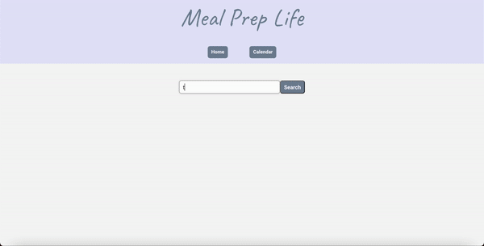

# Meal-prep-life

## Description
Meal Prep Life makes it easier for the everyday person with a busy schedule to find recipes they want and save them to their calendar. When they are ready to cook, they can simply go to their calendar and click on the recipe they want to start cooking. On the recipe page, they will find that they are able to easily keep track of where they are in the recipe with the use of the checkboxes next to all the ingredients and instructions. 

## User Story
```
AS A novice busy college student, 
I WANT to search for a recipe,
SO THAT I can plan my meals for the week and cook them when I get ready
```

## Acceptance Criteria
```
GIVEN a website with a search bar
WHEN I search for a recipe
THEN I am presented with the different recipe variations for the recipe I searched
WHEN I click the button under the recipe that I have selected 
THEN I am presented with a form where I can type my name and choose the day I want to add the recipe to
WHEN I view my calendar
THEN I am presented with today's date and a weekly calendar
WHEN I click on the day that I put my recipe under
THEN I am presented with a preview of the recipe and a button to start cooking
WHEN I click on the 'start cooking' button
THEN I am presented with the full recipe with checkboxes next to the ingredients and instructions and a 'Nutrition Checker' button
WHEN I click on the 'Nutrition Checker' button
THEN I am presented with a drop down bar which houses the nutrition checker
WHEN I insert an ingredient and value into the nutrition checker
THEN I am presented with the calories and weight of that ingredient
```
## Features
This meal planner application includes the following features:
- Search different recipes using keyword
- Save user's recipe on a calendar based on their selected day
- Preview recipe before start cooking
- Display checkboxes next to the ingredients and instructions enabling the user to track their cooking steps
- Search nutritional information of an ingredient

## Mock-Up
The following GIF displays the web application's appearance and functionality:


## Review
To review the refactored code, please go to the [repository](https://github.com/sistaniabong/meal-prep-life)

## Deploy
To deploy this web application, please click on this [link](https://sistaniabong.github.io/meal-prep-life/)